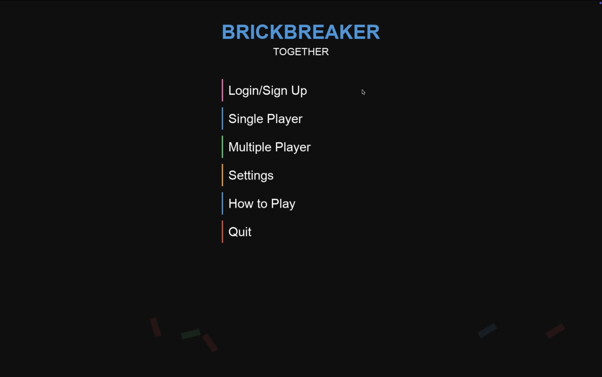
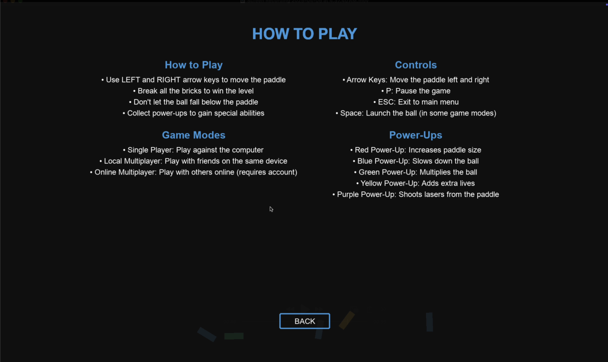
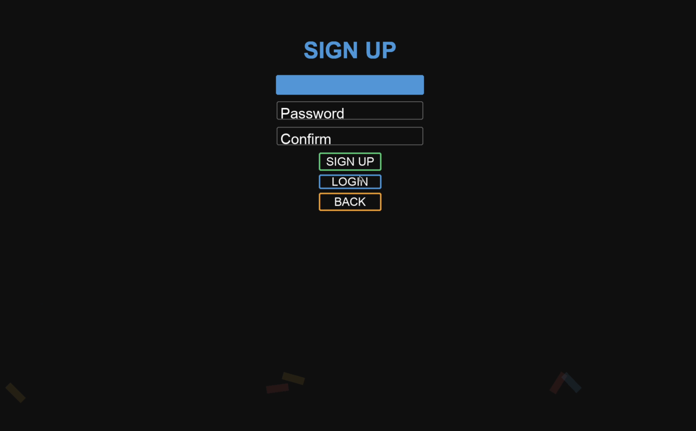
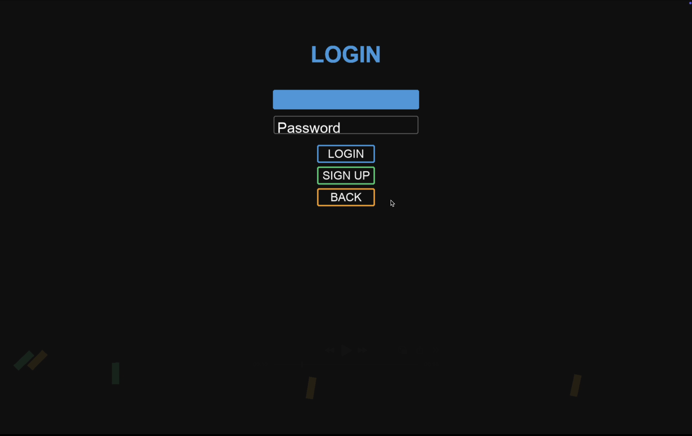
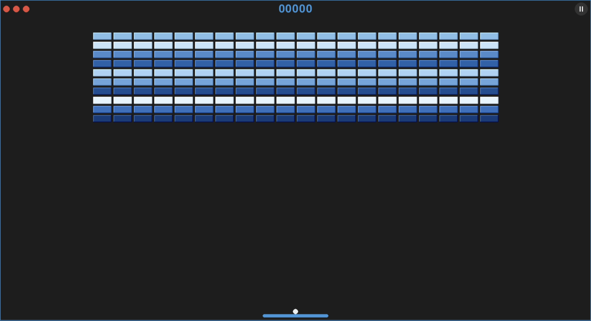
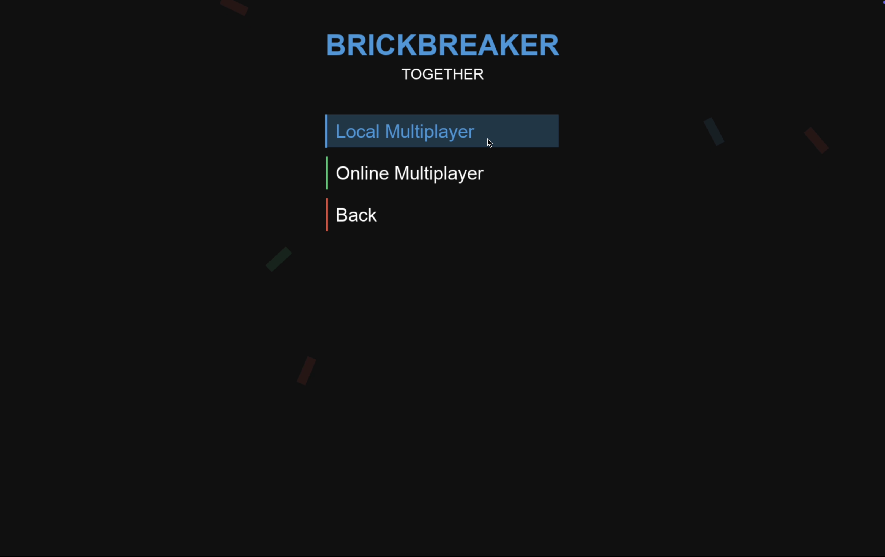
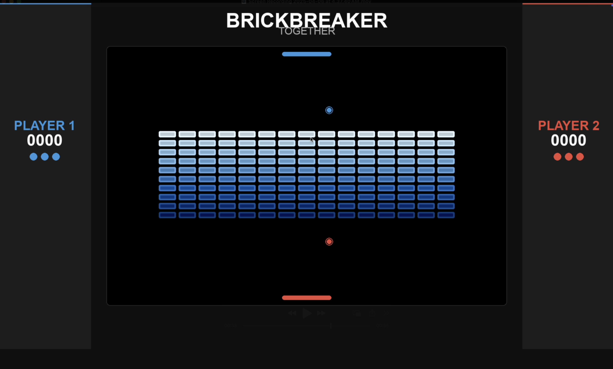

# Brickbreaker Together

A modern multiplayer Brickbreaker game developed using PyGame, featuring both single-player and multiplayer modes. Break bricks, collect power-ups, and compete with friends in this classic arcade game reimagined!

## Features

- 🎮 Single Player Mode
- 👥 Local Multiplayer Support
- 🎯 Multiple Power-ups
- 🏆 User Authentication System
- 🎨 Modern UI Design
- 🎵 Background Music

## Screenshots and Game Modes

### Main Menu

The main menu provides easy access to all game modes and features. Players can choose between Single Player, Multiplayer, access the How to Play guide, or manage their account through Login/Sign Up.

### How to Play

A comprehensive guide that explains game controls, power-ups, and different game modes. Perfect for new players to learn the basics of the game.

### Sign Up

Create your account to track your progress and compete with other players. Simple and straightforward registration process.

### Login

Secure login system for returning players to access their accounts.

### Single Player

Classic Brickbreaker gameplay where you control a paddle to break bricks and collect power-ups. Test your skills and aim for high scores!

### Multiplayer Menu

Choose between Local Multiplayer and Online Multiplayer (coming soon) game modes.

### Local Multiplayer

Challenge your friends in an exciting split-screen multiplayer mode. Compete to see who can break the most bricks and achieve the highest score!

## Setup Instructions

### Prerequisites
- Python 3.8 or higher
- Pygame library

### Installation Steps

1. Clone the repository:
```bash
git clone https://github.com/cis3296s25/Brickbreaker-together
cd Brickbreaker-together
```

2. Install required dependencies:
```bash
pip install pygame
```

3. Run the game:
```bash
cd Py
python main.py
```

## Controls

- **Arrow Keys**: Move paddle left/right
- **P**: Pause game
- **ESC**: Return to main menu
- **Space**: Launch ball (in some game modes)

## Power-ups

- 🔴 Red: Increases paddle size
- 🔵 Blue: Slows down the ball
- 🟢 Green: Multiplies the ball
- 🟡 Yellow: Adds extra lives
- 🟣 Purple: Shoots lasers from the paddle

## Contributing

We welcome contributions! Please feel free to submit a Pull Request. For major changes, please open an issue first to discuss what you would like to change.

## License

This project is licensed under the MIT License - see the LICENSE file for details.
