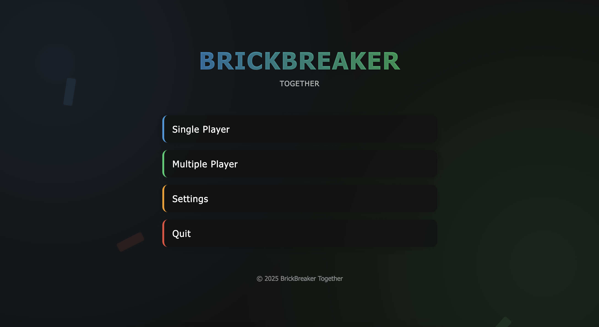

# Brickbreaker Together
A multiplayer BrickBreaker game developed using PyGame, a Python library for game development. The game is designed specifically for Windows systems and follows a client-server architecture.
Adding an screenshot or a mockup of your application in action would be nice.  


# How to run 
- Download the latest binary from the Release section on the right on GitHub.
- Ensure you have Python and Pygame installed. You can install Pygame using:
```
pip install pygame
```

# How to contribute
- We welcome contributions! Follow the steps below:
- Check the Project Board
- Stay updated on the latest project progress
- Fork & Clone the Repository
- Create a New Branch
- Make Changes & Commit
- Push & Create a Pull Request
- Then, open a pull request on GitHub.


### How to build
- To build and modify this project:
- Use this GitHub Repository: [This Repository](https://github.com/cis3296s25/Brickbreaker-together)
- main branch → Stable releases
- Use VSCode or any python IDE
- Must install pygame
- Run main.py
- The game window will launch after you run the game
- Enjoy!
